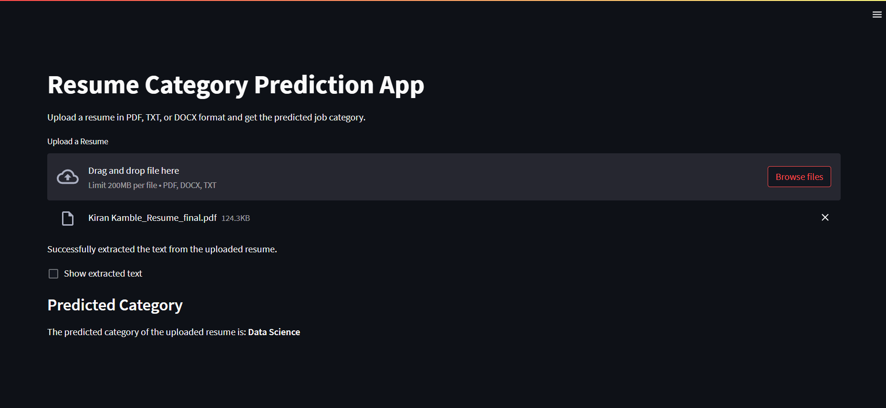

# Resume Category Prediction App

This project is a web application that predicts the job category of a resume using Natural Language Processing (NLP) techniques and machine learning. Users can upload a resume file in PDF, DOCX, or TXT format, and the app will display the predicted category of the resume.

## Features

- **Upload Resume**: Users can upload a resume in PDF, DOCX, or TXT format.
- **Text Extraction**: The application extracts text from the uploaded file.
- **Text Cleaning**: Processes and cleans the extracted text to remove unwanted symbols, links, and special characters.
- **Prediction**: Uses a pre-trained Support Vector Classifier (SVC) model to predict the resume's category.
- **Display Category**: The predicted category is displayed to the user.

## Requirements

- Python 3.x
- Streamlit
- pickle
- docx
- PyPDF2

